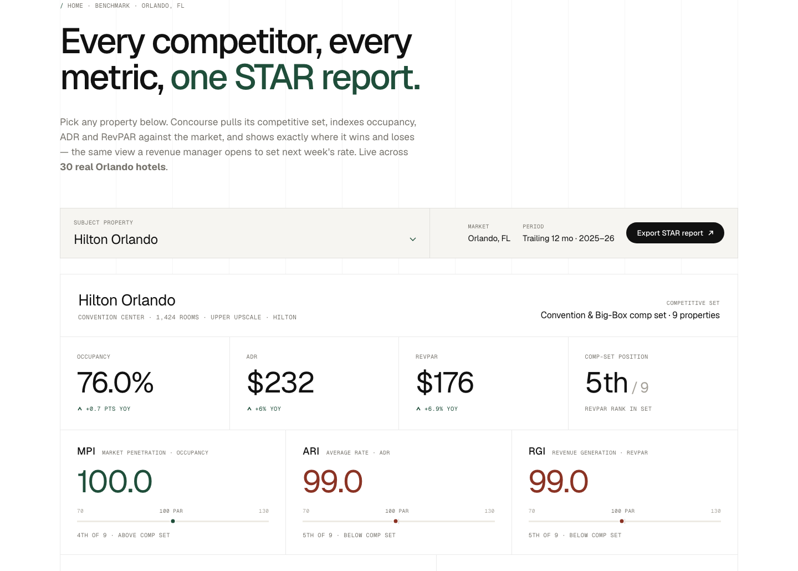

<div align="center">

# Concourse

### Competitive intelligence for hotels — STAR reports, comp sets, and market data in one place.

Concourse benchmarks a hotel against its **real competitive set** — occupancy, ADR, RevPAR and the
STR index metrics (MPI · ARI · RGI) — so revenue, sales, and ownership stop arguing over screenshots
and start making the call. Live today across **30 real Orlando, FL hotels**.

[](https://github.com/tylrcc/concourse)
[](#tech)
[](#tech)
[](LICENSE)

</div>



---

## What it is

Hotel revenue managers live and die by their **STAR report** — the STR/CoStar benchmark that shows how
a property performs against a hand-picked set of competitors. The problem: that intelligence is scattered
across weekly PDFs, exports, and spreadsheets. Concourse puts it on one screen.

Pick any property. Concourse pulls its competitive set, indexes occupancy / ADR / RevPAR against the
market, and shows exactly where it wins and loses — the same view a revenue manager opens to set next
week's rate.

| Metric | What it answers |
| --- | --- |
| **Occupancy / ADR / RevPAR** | The three numbers everything is built on. |
| **MPI** — Market Penetration Index | Are you filling rooms faster than your comp set? *(occupancy fair share)* |
| **ARI** — Average Rate Index | Are you priced above or below the set? *(rate fair share)* |
| **RGI** — Revenue Generation Index | The bottom line — occupancy and rate combined. *(revenue fair share)* |
| **Comp-set rank & 12-mo trend** | Where you sit in the set, and which way you're moving. |

Every index sits on a **100 = parity** scale: above 100 you're capturing more than your fair share, below
100 you're leaving it on the table. The comp-set aggregate is room-weighted and excludes the subject
property — exactly the way STR builds it.

---

## Pages

| Page | What it is |
| --- | --- |
| [`benchmark.html`](benchmark.html) | **The product.** Live STAR workspace — subject-property selector, KPI tiles, MPI/ARI/RGI index cards, ranked comp-set table, and a metric-toggle 12-month trend chart. Exports to a clean print/PDF report. |
| [`index.html`](index.html) | Editorial homepage centered on the competitive-intelligence story, with an Orlando coverage grid. |
| [`growth.html`](growth.html) | Market intelligence — 14 markets with 10-year demand forecasts, confirmed convention pipeline, development watch, and a news feed. Orlando front and center. |
| [`methodology.html`](methodology.html) | Plain-English definition of every metric and index, plus the honest note on the demo data. |
| [`venues.html`](venues.html) | Searchable, filterable property directory. |
| [`seminars.html`](seminars.html) | Revenue-management & AI-in-hospitality seminar catalog with registration. |
| [`contact.html`](contact.html) | Demo request + planner brief forms. |

## The Orlando dataset

Thirty **real** Orlando-area hotels across five competitive sets:

- **Convention & Big-Box** — Hyatt Regency Orlando, Gaylord Palms, Orlando World Center Marriott, Hilton Orlando, Rosen Shingle Creek, Signia by Hilton Bonnet Creek, Caribe Royale …
- **Luxury Resort** — Four Seasons Orlando, The Ritz-Carlton Grande Lakes, Waldorf Astoria Orlando, JW Marriott Grande Lakes
- **Universal Orlando** — Loews Portofino Bay, Hard Rock Hotel, Royal Pacific, Sapphire Falls, Cabana Bay, Aventura
- **Upscale I-Drive / SeaWorld** — Renaissance Orlando at SeaWorld, DoubleTree at SeaWorld, Wyndham I-Drive …
- **Lake Buena Vista / Disney Springs** — Walt Disney World Dolphin & Swan, Hilton Buena Vista Palace, Hilton LBV, B Resort …

Hotel **names, brands, submarkets and room counts are accurate and public**. Performance figures
(occupancy, ADR, RevPAR) are **representative estimates modeled on public Orlando market patterns and
seasonality — they are *not* licensed STR/CoStar STAR data.** The index methodology, comp-set logic, and
seasonality are production-grade, so the workspace behaves exactly as it would on live PMS + STR feeds.
See [`methodology.html`](methodology.html) for the full note.

<a id="tech"></a>
## Tech

Plain **HTML / CSS / JavaScript**. No framework, no bundler, no build step — open a file and it runs.

```
concourse/
├── benchmark.html          # STAR benchmarking workspace (the product)
├── index.html              # homepage
├── growth.html             # market forecasts & pipeline
├── methodology.html        # metric definitions + data note
├── venues.html  seminars.html  contact.html  …
├── styles/
│   ├── main.css            # design system
│   └── components.css      # page components incl. the benchmark workspace
├── scripts/
│   ├── star.js             # Orlando dataset + STAR engine + workspace rendering
│   ├── data.js             # markets, seminars, venues data
│   └── main.js             # shared nav, modal, toast, forms
└── docs/                   # README screenshots
```

The benchmark engine ([`scripts/star.js`](scripts/star.js)) computes everything deterministically:
RevPAR = Occupancy × ADR, room-weighted comp-set aggregates excluding the subject, MPI/ARI/RGI indices,
comp-set ranking, and an Orlando seasonality curve applied to a trailing-12-month series.

## Running it

Just open `benchmark.html` — everything works on `file://`.

For clean URLs:

```sh
git clone https://github.com/tylrcc/concourse.git
cd concourse
python3 -m http.server 8000
# open http://localhost:8000/benchmark.html
```

## What's interactive

- **Benchmark** — switch the subject property and every KPI, index card, trend chart, and comp-set
  table repaints live; toggle the chart between Occupancy / ADR / RevPAR; export to a print-clean STAR report.
- **Growth** — market tiles drive a live SVG forecast chart, KPI tiles, pipeline list, and dev notes.
- **Venues** — live search, region / type / capacity filters, and sort.
- **Forms** — inquiry, registration, demo, and brief forms are intercepted, validated, and confirm via toast.
- Sticky hide-on-scroll nav, mobile menu, quote carousel, and scroll-reveal throughout.

## Roadmap

- [ ] Live PMS + STR feed connectors (replace modeled data with actuals)
- [ ] Custom comp-set builder per property
- [ ] Day-of-week and segment (group vs. transient) breakdowns
- [ ] Forecast vs. actual pace view
- [ ] Multi-market expansion beyond Orlando

## Disclaimer

Concourse is an independent project. It is **not affiliated with, endorsed by, or sourced from**
STR, CoStar, or any hotel brand named in the dataset. "STAR report," "MPI," "ARI," and "RGI" are used as
the industry-standard benchmarking terms they have become. Demo performance data is modeled, not real
proprietary data.

## License

[MIT](LICENSE) © 2026 Concourse Research, Inc.
